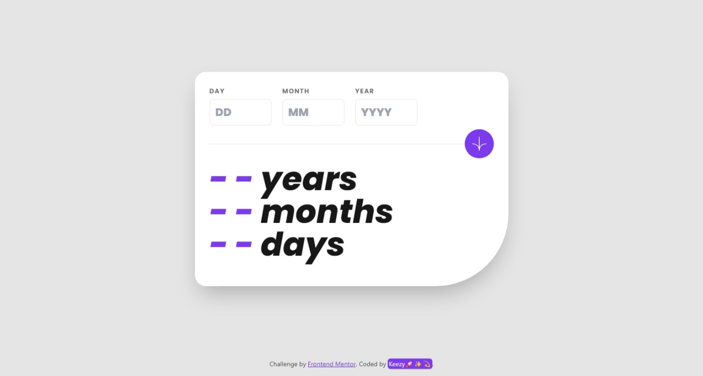

# Frontend Mentor - Age calculator app solution

This is a solution to the [Age calculator app challenge on Frontend Mentor](https://www.frontendmentor.io/challenges/age-calculator-app-dF9DFFpj-Q). Frontend Mentor challenges help you improve your coding skills by building realistic projects.

## Table of contents

- [Overview](#overview)
  - [Screenshot](#screenshot)
  - [Links](#links)
- [My process](#my-process)
  - [Built with](#built-with)
  - [Continued development](#continued-development)
  - [Useful resources](#useful-resources)
- [Deploy on Vercel](#deploy-on-vercel)
- [Author](#author)

## Overview

This is a [Next.js](https://nextjs.org/) project bootstrapped with [`create-next-app`](https://github.com/vercel/next.js/tree/canary/packages/create-next-app).

### Screenshot

### Links

- Solution URL: [The Solution](https://www.frontendmentor.io/solutions/keezys-responsive-age-calulator-app-with-nextjs-13-and-tailwindcss-ijBrfdu3I0)
- Live Site URL: [The Site](https://keezy-age-calculator.vercel.app/)

## My process

### Built with

- Typescript
- [React](https://reactjs.org/) - JS library
- [Next.js](https://nextjs.org/) - React framework
- [Tailwind CSS](https://tailwindcss.com/) - For the Style

### Continued development

I am still trying to understand Nextjs 13 in details
I am also new to Typescript

### Useful resources

- [Nextjs 13 Beta Local Fonts](https://beta.nextjs.org/docs/optimizing/fonts#local-fonts) - This helped me to figure out how to insert my local fonts into the project
- [Number Counting Animation](https://youtu.be/FaMW-CtExrs) - This helped me with my beautiful number counting animations

## Deploy on Vercel

The easiest way to deploy your Next.js app is to use the [Vercel Platform](https://vercel.com/new?utm_medium=default-template&filter=next.js&utm_source=create-next-app&utm_campaign=create-next-app-readme) from the creators of Next.js.

Check out our [Next.js deployment documentation](https://nextjs.org/docs/deployment) for more details.

## Author

- Website - [Keezy🚀✨💫](https://sani-alhassan.netlify.app/)
- Frontend Mentor - [@Kaculoss](https://www.frontendmentor.io/profile/Kaculoss)
- Twitter - [@Sani_M_Alhassan](https://twitter.com/Sani_M_Alhassan)
